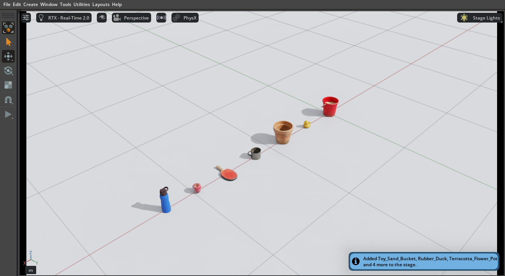
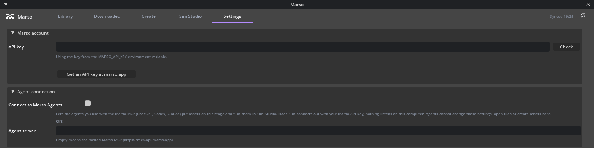
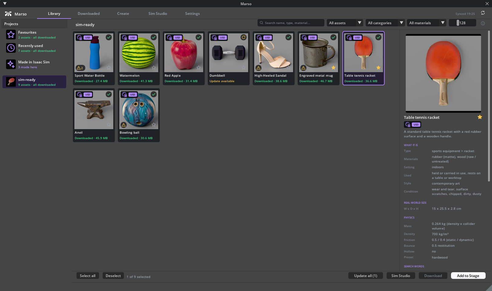
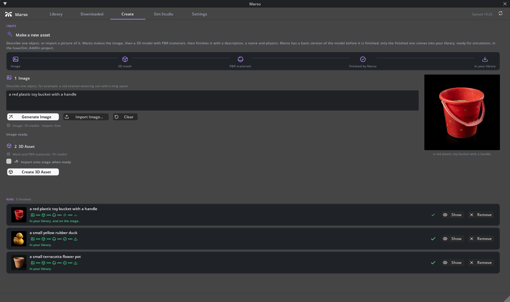
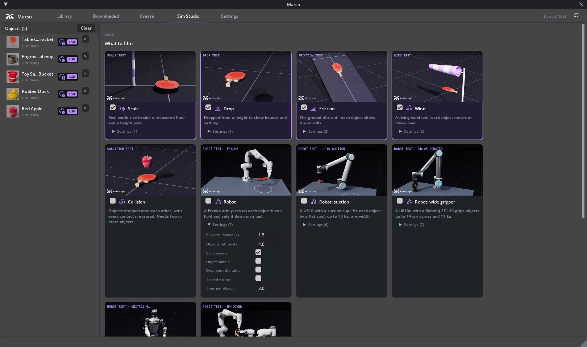

# Marso Library for NVIDIA Isaac Sim

**Your [Marso](https://marso.app/) assets, inside Isaac Sim.** Browse your Marso projects, download their PBR assets as USD, drop
them on the stage at real-world size with physics, make new assets from a description or a picture, and film them in
branded physics and robot test videos, without leaving Isaac Sim. Made by [M-XR](https://m-xr.com).

- **Library**: all your Marso projects and assets, with search, filters, favourites and Marso's own notes on each asset.
- **Add to Stage**: assets land upright, at real-world size, with a ground and physics scene, ready to press Play.
- **Create**: image, 3D mesh and PBR materials, then Marso finishes it with a name, a description and physics.
- **Sim Studio**: scale, drop, friction, wind and collision tests, plus five robot tests, rendered as videos.
- **Agent connection** (off by default): let ChatGPT, Codex or Claude, through the Marso MCP, work in your Isaac Sim.

## What you need

- **NVIDIA Isaac Sim 6.0 or later** (tested with 6.0.1 on Windows) on a computer with an NVIDIA RTX GPU.
- **A Marso account and API key.** Get one at [marso.app](https://marso.app/).
- An internet connection. Robot tests download NVIDIA's robot models the first time they run.

## Install

The add-on installs from the Extension Manager, from this repository's registry. There is nothing to download by hand.

1. In Isaac Sim, open **Window > Extensions**.
2. Click the **menu icon (three lines) next to the search box** and choose **Settings**.
3. Under **Extension Registries**, click the **+** button, then double-click the new row to set:
   - **Name:** `Marso`
   - **URL:** `https://mxr-software.github.io/marso-isaacsim-registry`
4. Back in the extension list, search for **Marso**, open **Marso Library**, click **Install**, then switch it on.
   Tick **Autoload** so it starts every time.
5. The Marso window opens beside the Content browser. Reopen it any time from **Window > Marso Library**.

Starting Isaac Sim from a command line instead? Add
`--/exts/omni.kit.registry.nucleus/registries/N/url=https://mxr-software.github.io/marso-isaacsim-registry` (N is the next free
slot) and `--enable marso.library`.

**Updates.** When a new version is published, the Extension Manager offers it on the Marso Library page.

## Quick start

### 1. Connect your account

Open the **Settings** tab, paste your Marso API key, and press **Check**. (If the `MARSO_API_KEY` environment variable
is set, the add-on uses it whenever the field is empty.)

### 2. Find an asset and put it on the stage

1. Open a project in the **Library** tab. Thumbnails load when you open a project, so a big library stays quick.
2. Click an asset to see what Marso knows about it on the right: what it is, its materials, real-world size, and
   physics (mass, density, friction, bounce). The **Search** box looks through names, types, materials and tags.
3. Press **Download** (or **Download all missing**). Each asset is prepared for Isaac Sim as it arrives.
4. Press **Add to Stage**, or drag a tile into the viewport to drop it where you point.
   Several assets added together land in a row, a grid or a stack, on a ground with physics.
5. Press **Play** in Isaac Sim: sim-ready assets fall and collide.

What the badges on a tile mean:

| Badge | Meaning |
| --- | --- |
| Sphere glyph, `USD` | A PBR model, downloaded as a USD file |
| Sphere with an atom | **Sim-ready**: the file has a rigid body and colliders |
| Tick | Downloaded |
| Circular arrows | **Update available** in Marso |
| Star | A favourite (favourites and recently used sit at the top of the project list) |
| Warning triangle | **Worth a look**: Marso's review notes and the add-on's own size and mass checks |

The **Downloaded** tab lists everything on your computer, offline, grouped by project.

### 3. Make a new asset

1. In the **Create** tab, describe one object and press **Generate Image** (10 credits), or press **Import Image...** to
   use your own picture (free).
2. Press **Create 3D Asset** (about 70 credits). Marso builds the 3D mesh and PBR materials, then finishes the asset
   with a name, a description and physics. It takes a few minutes and carries on in the background.
3. Tick **Import onto stage when ready** if you want it on the stage as soon as it arrives.
4. The finished asset is downloaded and appears in the Library under **Made in Isaac Sim**.

Costs and your balance show before you press each step. If Isaac Sim closes part-way, the run resumes from the same step
next time, so nothing is paid for twice.

### 4. Film it in Sim Studio

1. Select one or more assets in the Library and press **Sim Studio**.
2. Tick the tests you want. Each card shows what it films, and opens its own **Settings**:

   | Test | What it shows |
   | --- | --- |
   | Scale | The objects beside a height pole, with their size and mass |
   | Drop | Dropped from a height: bounce, settling, rebound |
   | Friction | A table tilts until each object slides, tips or rolls |
   | Wind | A rising wind until each object moves or blows over |
   | Collision | Objects dropped onto each other, with every contact measured |
   | Robot tests | A Franka arm, a UR10 with a suction cup, a UR10e with a wide gripper, two Franka arms handing an object over, and a Unitree G1 humanoid |

3. Choose a quality (Preview to 4K), an aspect (16:9, 9:16, 1:1 or 4:5) and branded or clean footage, then press **Render**.
4. It renders in a separate Isaac Sim, so you can keep working. Each run saves its videos, a results card for each test, an
   editable scene you can open in Isaac Sim, and a report, by default under `Documents/Marso/Sim Studio`.

### 5. Optional: connect your AI agents

Turn on **Settings > Agent connection > Connect to Marso Agents**, then add `https://mcp.api.marso.app/mcp` to your chat app
(ChatGPT, Codex or Claude). Agents can then add Marso assets to your stage, download them, take a viewport screenshot, and run
Sim Studio, and the finished video appears in your chat.

- Isaac Sim connects *out* to the Marso MCP with your API key; nothing listens on your computer.
- Agents cannot change your settings or folders, use the Create tab, delete downloads or open files.
- It is off until you switch it on.

## Files and folders

| What | Where (default) |
| --- | --- |
| Downloaded assets | `Documents/Marso/Downloads` (Settings > Storage; shareable with the Marso Blender add-on) |
| Thumbnails and the last listing | Your local app-data folder, `Marso/IsaacSim/Cache`; safe to delete |
| Sim Studio videos | `Documents/Marso/Sim Studio` |

## Troubleshooting

- **Marso is not found in the extension list:** check the registry URL for typos, with no trailing `/v2`, and that Isaac Sim
  can reach `mxr-software.github.io`.
- **"Marso rejected the API key":** copy the key again from [marso.app](https://marso.app/) and press **Check**.
- **A tile says "no USD package":** the asset has no USD version in Marso yet.
- **A robot test says it could not load the robot:** the first run downloads NVIDIA's robot models, so it needs internet.

More detail is in the add-on's own documentation: in the Extension Manager, open **Marso Library** and read its README.

## About this repository

This repository holds only the published extension files (`v2/`, written by Kit's extension publisher) and this page. Do not
edit `v2/` by hand. Questions or problems: contact M-XR at <https://m-xr.com>.
